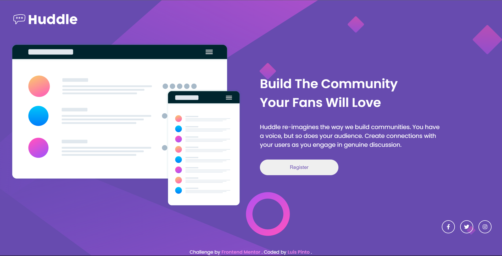

# Huddle Page

# 

A challenge made for Frontend Mentor.

> Check it out: [https://FlashCodX.github.io/huddle-page/](https://FlashCodX.github.io/huddle-page/)

## Tech

- [React] - HTML enhanced for web apps!
- [CSS Modules] - Used to prevent class overlap.
- [ReactIcons] - Icons used for the app.

## License

MIT

**Free Software, Hell Yeah!**

[react]: https://reactjs.org/
[reacticons]: https://react-icons.github.io/react-icons
